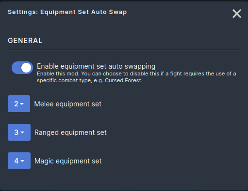

# Equipment Set Auto Swap mod for Melvor Idle

Link to mod.io: [Equipment Set Auto Swap](https://mod.io/g/melvoridle/m/equipment-set-auto-swap)

This [Melvor Idle](https://melvoridle.com/) mod will automatically swap to the ideal equipment set to take advantage of Combat Triangle bonuses (e.g. it'll swap to your magic set if you're fighting a melee enemy). This is particularly useful for end-game auto-slayer so you can leave auto-slayer enabled without fear of death (if appropriately geared for all types of combat). Note: This mod fully supports base, TotH, and AoD. It should fully support ItA, but I have not progressed far enough into the expansion to playtest end-game ItA content yet (i.e. I have not playtested Abyssal Strongholds or Eternal damage monsters - let me know if this mod works as intended if you get there before I do).

Inspired by [SEMI Auto Gear Swap](https://mod.io/g/melvoridle/m/semi-auto-gear-swap) but allows you to select your desired equipment sets rather than assuming the first set with a melee weapon is your melee set.

Warning: This does *not* check whether you have sufficient ammo/runes, so make sure you have enough if you decide to e.g. run auto-slayer for an extended period of time.
